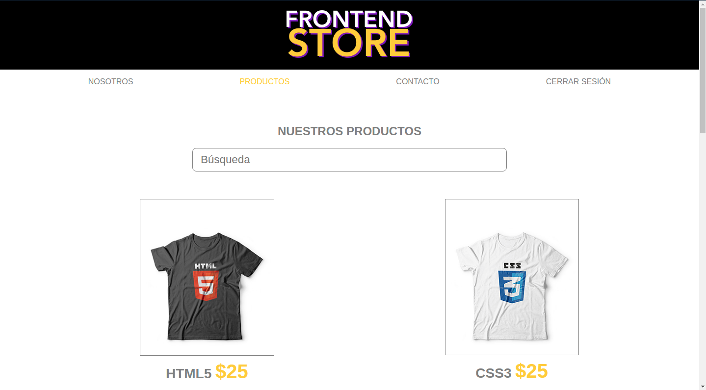

# Frontend Store

Aplicación desarrollada en ReactJS que permite visualizar los productos de una tienda online, la cual proporciona detalles de los productos, formulario para enviar mensajes y ademas tiene un sistema de login. Algunas de las features que tiene son:

* Utilización de React Hooks
* Implementación de servidor express para consumir los productos
* Utiliza Auth0 para el ingreso y registro como método se seguridad
* Sistema se sesión por medio de tokens

## Scripts

* `npm install` para instalar las dependencias
* `cd client && npm run dev` para entorno de desarrollo
* `cd server && npm run server` para iniciar el servidor
* `cd client && npm run build && npm start` para producción

**Nota**: en caso de no tener instalado el **serve** para correr el entorno de desarrollo, se puede instalar mediante el siguiente comando: `npm i --save serve` o `npm i -g server`

## Licencia

MIT

This project was bootstrapped with [Create React App]
(https://github.com/facebookincubator/create-react-app).
